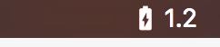

# BatteryCurrent

## Download
[v1.0 release](https://github.com/vkopitsa/BatteryCurrent/releases/download/v1.0/BatteryCurrent.app.zip).

## Compatibility
BatteryCurrent is only available for OS X 10.9 or later.

### Licence
BatteryCurrent is available under the MIT license. See the LICENSE file for more info.

Icons are copyrighted by their respective authors.
